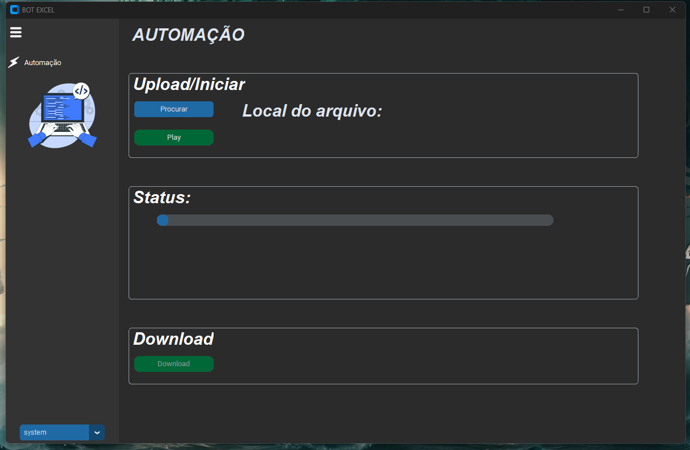

<div align="center">


# Bot Excel

**Automação de planilhas Excel com interface gráfica: carregue um `.xlsx`, processe com pandas e salve o resultado, acompanhando o progresso.**




</div>

---

Projeto de estudo: um esqueleto de automação de planilhas com interface em [customtkinter](https://github.com/TomSchimansky/CustomTkinter). O fluxo carregar → processar → salvar está pronto; a etapa de processamento é uma **simulação**, feita para ser trocada pela regra de negócio que você precisar.

## Requisitos

- Python 3.10 ou mais novo
- Pacotes em `requirements.txt`: customtkinter, pandas, openpyxl e Pillow

## Instalação

```bash
git clone https://github.com/Luis-lhgdf/bot-excel.git
cd bot-excel
pip install -r requirements.txt

python main.py
```

## Como usar

| Ação | Resultado |
|---|---|
| **Procurar** | Abre o seletor de arquivos e carrega o `.xlsx` em um DataFrame |
| **Play** | Inicia o processamento em uma thread separada; a barra de **Status** acompanha o progresso |
| **Download** | Salva o DataFrame processado em um novo arquivo Excel |
| Seletor no rodapé | Tema `system`, `light` ou `dark` |
| `☰` | Recolhe o menu lateral |

## Funcionalidades

- Carrega arquivos Excel (`.xlsx`) com pandas.
- Processa em segundo plano, sem travar a interface, com barra de progresso e mensagens de status.
- Salva o resultado em um novo arquivo; o original não é alterado.
- Menu lateral recolhível e tema claro/escuro.

## Onde entra a sua automação

A classe `Automation`, em `automation.py`, concentra a leitura (`pd.read_excel`), o processamento simulado e a gravação (`to_excel`). Troque a etapa de processamento pela sua lógica com pandas e o resto da interface continua igual.

## Estrutura

```
main.py                  ponto de entrada
main_view.py             janela principal, menu lateral e navegação
automation.py            carga, processamento (simulado) e gravação da planilha
appearance_manager.py    fontes e tema claro/escuro
icons.py                 carrega os ícones da pasta icon/
text.py                  textos da interface
CTkXYFrame/              frame com rolagem nos dois eixos (componente de terceiros)
icon/                    ícones e logotipo
docs/                    prints usados neste README
```

---

## English

Excel spreadsheet automation with a customtkinter GUI: load an `.xlsx`, run a (simulated) pandas processing step with a progress bar, and save the result to a new file. Meant as a starting point — replace the simulated step in `automation.py` with your own logic. Requires Python 3.10+. **Interface is in Portuguese.**

```bash
pip install -r requirements.txt
python main.py
```

---

## Licença

MIT — veja [LICENSE](LICENSE).
